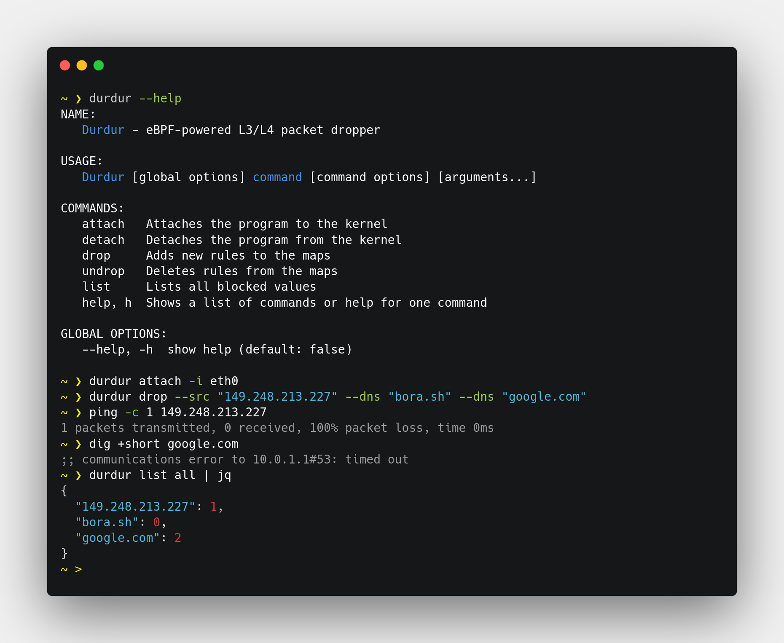

# Durdur 🐝

[](https://github.com/boratanrikulu/durdur/actions)
[](https://goreportcard.com/report/github.com/boratanrikulu/durdur)
[](https://github.com/boratanrikulu/durdur/blob/main/LICENSE)

[Durdur](https://www.youtube.com/watch?v=sF0QweCoaMo) is a CLI tool for Linux implementing L3/L4 packet dropping with eBPF/Go.



## How to use

Durdur is easy to use with just four commands: **`attach`**, **`detach`**, **`drop`**, and **`undrop`**.  
All commands should be run with **root privileges**.

### Attach

**`attach`** installs Durdur on the system for a specific interface.

```sh
durdur attach --interface eth0
```

### Detach

**`detach`** uninstalls Durdur from the system.

```sh
durdur detach
```

### Drop and Undrop

**`drop`** and **`undrop`** checks all L3 and L4 packets in the system and either block or allow them.  
Both commands support the following flags:  

- **`to`** for the destination address value of an IPv4 packet.
- **`from`** for the source address value of an IPv4 packet.
- **`dns`** for the domain value of a DNS packet.

Example usage for **`drop`**;

```sh
durdur drop --from "192.0.1.1"
```

```sh
durdur drop --dns "example.com"
```

Example usage for **`undrop`**;

```sh
durdur undrop --from "192.0.1.1"
```

```sh
durdur undrop --dns "example.com"
```

## How to install

### From source;

Build and use `build/durdur` binary.

```
make build
```

### From Docker image;

Build the image.  
```sh
make build-docker
```

Run the container with **privileges**.  

Example usage;  

```sh
docker run --rm -i -t --net="host" --privileged -v /sys/fs/bpf:/sys/fs/bpf durdur -- attach -i eth0
```

```sh
docker run --rm -i -t --net="host" --privileged -v /sys/fs/bpf:/sys/fs/bpf durdur -- drop --dns "example"
```

PS: You don't need to use `--net="host"` if you don't want to access host's interfaces.

## TODO

- [ ] Add wildcard support to DNS.
- [ ] Add IPv6 support.
- [ ] Add **`list`** command for added rules.
- [ ] Add port support

## Copyright

[GPL-3.0 license](https://github.com/boratanrikulu/durdur/blob/main/LICENSE),  
Copyright 2022-2023 Bora Tanrikulu <[me@bora.sh](mailto:me@bora.sh)>
